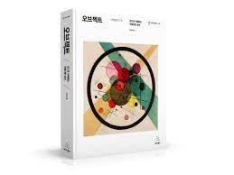

# Objects

    

## 💻 공부는 Notion 개인 페이지를 통해 정리하였습니다.

 

## "오브젝트"
[Chapter 01. 객체, 설계](https://moondongmin.notion.site/01-109357c44e5680e5891ded57604a8819?pvs=4)

[Chapter 02. 객체지향 프로그래밍](https://www.notion.so/moondongmin/02-111357c44e5680a2b05ff8c6a7760e5c?pvs=4)

[Chapter 04. 설계 품질과 트레이드오프](https://moondongmin.notion.site/Chapter-04-11b357c44e5680f5965be9efec7aa22f?pvs=4)

[Chapter 05. 책임 할당하기](https://moondongmin.notion.site/Chapter-05-11c357c44e5680738990dc3b6d04b381?pvs=4)
